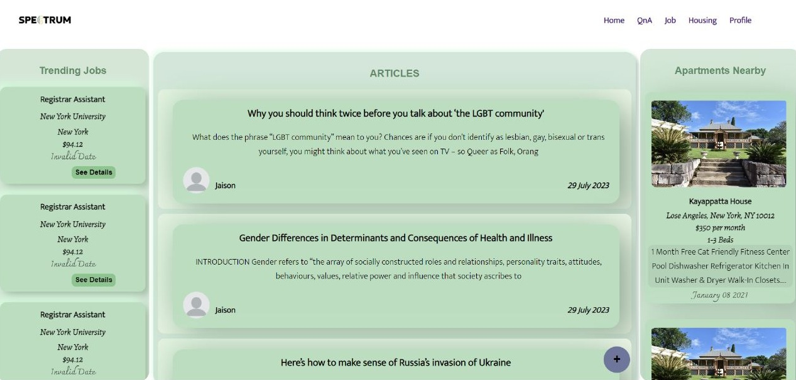
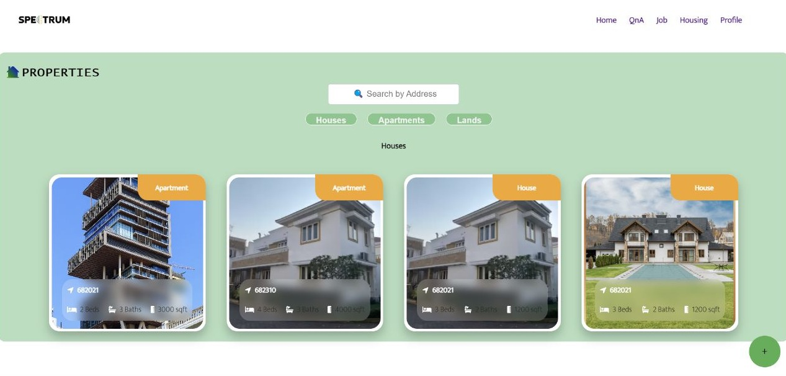

# SPECTRUM: LGBTQ+ Community Web Portal

## Abstract

We developed "SPECTRUM: LGBTQ+ Web Portal" to create a secure online space fostering connections, give support and empower LGBTQ+ individuals and their allies. This platform features User Authentication,User Login,Company Login, Admin Page, Profile Page, Q&A forums, Blog management system and Rental-Home & Job  Search functionality. SPECTRUM offers a positive virtual community where users can freely express themselves, find resources, and receive peer support.

---

## Table of Contents 
- [Abstract](#abstract)
- [Project-Overview](#project-overview)
- [Installation](#installation)
- [Usage](#usage)
- [Screenshots](#screenshots)
- [Credits](#credits)

---

| HTML                                                      | CSS                                                      | ReactJS                                                      | NodeJS                                                      | MongoDB                                                      |
|-----------------------------------------------------------|----------------------------------------------------------|-------------------------------------------------------------|-------------------------------------------------------------|-------------------------------------------------------------|
|  |  |  |  |  |

---

## Project-Overview

**Q: What motivated us to create the SPECTRUM: LGBTQ+ Web Portal?**

**A:** We wanted to give LGBTQ+ people a place to connect, share their stories, and find resources.Existing social media platforms didn't fully address their challenges. We aimed to create a space that promotes positive interactions, support, and resource accessibility.


**Q: What problem does SPECTRUM solve?**

**A:** SPECTRUM addresses the challenges of isolation, discrimination, and lack of resources faced by LGBTQ+ individuals. It provides a secure online community where they can connect, find housing and job opportunities, and receive support from peers.

**Q: What can you learn from this project?**

**A:** This project teaches the significance of community-specific solutions. We gained insights into the struggles of LGBTQ+ individuals and how technology can empower them. Technically, we learned about user authentication, job search features, Q&A forums, and content management,admin management using  HTML/CSS, ReactJS, Nodejs & MonogoDB.

**Q: What's unique about SPECTRUM's features?**

**A:** SPECTRUM's features are designed to be inclusive and resourceful. From user authentication to job searches, Q&A forums, and content management, each aspect caters specifically to the LGBTQ+ community's needs and experiences.It provides 

- **Dual Login System:** Facilitating both user and company logins, providing distinct experiences tailored to individual needs.
- **Admin Control:** A dedicated admin page empowers administrators to review and report blog contents, and approve company profiles to maintain content quality.
- **Blogging Platform:** Users can contribute their thoughts, experiences, and insights by posting blogs, fostering a sense of community engagement and self-expression.
- **Housing Listings:** A dedicated space for posting house rental details, enhancing the portal's practical utility for users seeking suitable housing.
- **Job Listings:** Companies can post job listings, contributing to career opportunities specifically focused on LGBTQ+ individuals.
- **Q&A Forums:** Users can ask questions, share knowledge, and receive answers, creating a dynamic knowledge-sharing hub within the community.
- **Profile Activity Hub:** Users can access a consolidated profile page displaying their blog posts, questions, answers, and interactions, simplifying engagement tracking.
- **Centralized Communication:** The platform acts as a hub for users, enabling them to write blogs, ask questions, reply to answers, and engage with their community in one cohesive space.

 

**Q: What's the impact of SPECTRUM on the LGBTQ+ community?**

**A:** SPECTRUM creates a positive online environment where LGBTQ+ individuals can find understanding, resources, and connections. It addresses their unique needs and offers them a platform to express themselves freely while seeking support.

---

## Installation

Follow these steps to set up the SPECTRUM: LGBTQ+ Web Portal on your local environment:

1. Clone the repository:
   ```bash
   git clone https://github.com/hannasalam/Spectrum.git

2. Navigate to the project directory:

   ```bash
   cd Spectrum
3. Install backend dependencies:

   ```bash
   cd backend
   npm install
4. Create a `.env file` in the `backend` directory and add the required environment variables, such as database connection details and API keys.
5. Return to the main project directory:
   ```bash
   cd ..
6. Install frontend dependencies:
   ```bash
    cd backend
    npm install
7. Start the backend server:
   ```bash
   cd backend
   npm start
8. In a separate terminal window, start the frontend development server:
   ```bash
   cd frontend
   npm start

---

## Usage

Explore the features and functionality of the SPECTRUM: LGBTQ+ Web Portal through the following screenshots and diagrams:

## Screenshots


*User Login: Securely access your account*


*User Signup: Register to join the community*


*Company Signup: Businesses can create accounts*


*Admin-Company Approval: Ensuring content quality*


*Home Page: Welcome to the SPECTRUM Community*


*Profile Page: Your activities and contributions in one place*


*Q&A Forum: Engage in knowledge-sharing discussions*


*Add Property Form: Submit housing details*


*Housing Listings: Explore available rentals*


*Housing Details: Information about a specific property*


*Add Job Listings: Companies can post career opportunities*


*Job Page: Explore job listings and opportunities*

---

## Diagrams


*Database Diagram*


*Use Case Diagram: Interactions between users and the system*


*DFD Level 0*


*DFD LEVEL 1 for Jobs and Houses*


*DFD LEVEL 1 for Blogs & Q A*


*Activity Diagram for Blog*


*Activity Diagram for Housing*


*Activity Diagram for Job*


*Activity Diagram for Q&A*


*Activity Diagram for User*

---

## Contributors ✨

Thanks go to these wonderful people:

<table>
  <tbody>
    <tr>
      <td align="center" valign="top" width="14.28%">
        <a href="https://github.com/amaldevcd">
          <br />
          <sub><b>Amal Dev</b></sub>
        </a><br />
        <a href="https://github.com/amaldevcd" title="GitHub Profile">🖥️🔧</a>
      </td>
      <td align="center" valign="top" width="14.28%">
        <a href="https://github.com/fayazap">
          <br />
          <sub><b>Fayaz A P</b></sub>
        </a><br />
        <a href="https://github.com/fayazap" title="GitHub Profile">💻🎨</a>
      </td>
      <td align="center" valign="top" width="14.28%">
        <a href="https://github.com/hannasalam">
          <br />
          <sub><b>Hanna Salam</b></sub>
        </a><br />
        <a href="https://github.com/hannasalam" title="GitHub Profile">🖥️🔧</a>
      </td>
      <td align="center" valign="top" width="14.28%">
        <a href="https://github.com/albymat32">
          <br />
          <sub><b>Alby Thekkedan</b></sub>
        </a><br />
        <a href="https://github.com/albymat32" title="GitHub Profile">💻🎨</a>
      </td>
      <td align="center" valign="top" width="14.28%">
        <a href="https://github.com/jaison080">
          <br />
          <sub><b>Jaison Thomas</b></sub>
        </a><br />
        <a href="https://github.com/jaison080" title="GitHub Profile">💻📢</a>
      </td>
    </tr>
  </tbody>
</table>

---

 

## 🏆Badges


